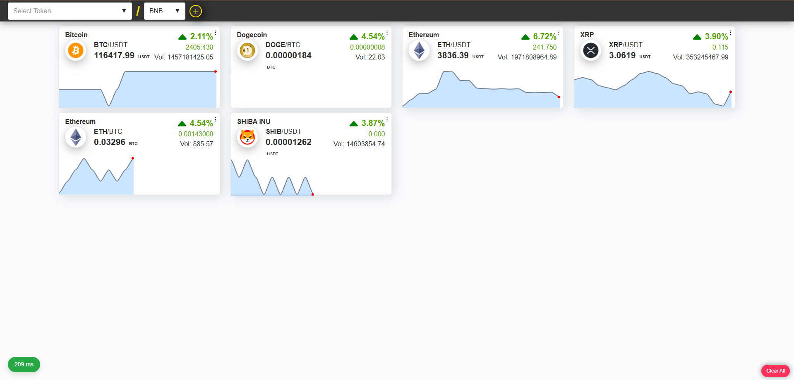

# Darya Solutions - Senior Front-end Developer Coding Challenge

This project is a real-time cryptocurrency ticker dashboard built as a coding challenge. The application connects to Binance's WebSocket streams to display live price updates for various cryptocurrency pairs.

The primary focus of this project was to build a **resilient, robust, and user-friendly** front-end application that can gracefully handle network interruptions and maintain data integrity.

---

## Key Features

This application successfully implements all the required features, focusing on robustness and user experience.

<table align="center">
  <tr>
    <td align="center"><strong>Normal Operation View</strong></td>
    <td align="center"><strong>Graceful Degradation (Disconnected)</strong></td>
  </tr>
  <tr>
    <td></td>
    <td></td>
  </tr>
</table>

#### 1. **Real-Time Connection Monitoring**
* A dedicated, secondary WebSocket connection acts as a **heartbeat/ping-pong** mechanism to monitor network latency and detect connection failures within seconds.
* A Telegram-style status indicator provides users with real-time feedback on the connection state (`Connecting`, `Connected`, `Reconnecting`, `Disconnected`).

#### 2. **Automatic Reconnection Strategy**
* The application automatically attempts to reconnect upon connection loss.
* It uses an **Exponential Backoff** algorithm, increasing the delay between attempts to avoid overwhelming the server.
* Random **jitter** is added to the delay to prevent synchronized "thundering herd" reconnection attempts.
* A maximum retry limit is in place to prevent infinite loops, after which the application enters a final "Disconnected" state.

#### 3. **Data Integrity During Outages**
* Upon a successful reconnection, the application automatically fetches a **snapshot** of the latest data for all subscribed tickers via the Binance REST API.
* This ensures that any data missed during the outage is recovered, and the user is always presented with the most up-to-date information once the connection is restored.

#### 4. **User Experience (Graceful Degradation)**
* **Visual Indicators:** The connection status is always visible to the user.
* **Clear Messaging:** When the connection is lost, a "frosted glass" overlay appears on the data board, clearly informing the user that the displayed data is stale.
* **Preventing Invalid Actions:** UI elements required for live data (like adding a new currency pair) are automatically disabled during disconnection to prevent user errors.
* **Smooth Transitions:** The snapshot mechanism ensures a smooth visual transition when the connection is restored, as all data updates at once to the correct state.

#### 5. **State Management**
* **Pinia** is used for robust, centralized state management.
* The user's selected currency pairs are preserved across sessions using **`localStorage`**.
* The application state (list of currencies, latest ticker data) is correctly preserved during WebSocket reconnection cycles.

---

## Tech Stack

* **Framework:** Vue 3 (Composition API)
* **Build Tool:** Vite
* **State Management:** Pinia
* **Language:** TypeScript
* **Network Protocols:** WebSocket, REST API

---

## Project Setup

### Prerequisites
* Node.js (v18.x or later recommended)
* npm or yarn

### Installation & Running

1.  **Clone the repository:**
    ```sh
    git clone https://github.com/amiagr/darya-solutions-challange.git
    cd darya-solutions-challange
    ```

2.  **Install dependencies:**
    ```sh
    yarn install
    ```

3.  **Run the development server:**
    ```sh
    yarn dev
    ```

4.  Open your browser and navigate to `http://localhost:8001` (the address specified in the console).

---

## Architectural Decisions

* **Service-Oriented Architecture:** The logic is decoupled into distinct services (`WebSocketWrapper`, `Api`, `PingService`) to adhere to the Single Responsibility Principle, making the code more modular and maintainable.
* **Centralized State:** Pinia serves as the single source of truth for the application state, simplifying data flow and ensuring consistency across components.
* **Decoupled UI:** Components are responsible for displaying data and dispatching user actions, while the underlying services and store handle the business logic, network communication, and state mutations.

## Possible Future Improvements

Given more time, the following improvements could be made:

* **Unit & E2E Testing:** Implementing a comprehensive testing suite with Vitest and Cypress.
* **Full Data Integrity:** Implementing a message buffer and sequence number validation (as per Binance's official documentation) to handle the rare race condition between snapshot recovery and receiving the first few live events.
* **Web Workers:** Offloading WebSocket communication to a Web Worker to ensure the main UI thread remains unblocked, even with a high volume of incoming messages.
* **Accessibility (a11y):** A thorough audit to ensure the application is fully accessible.
